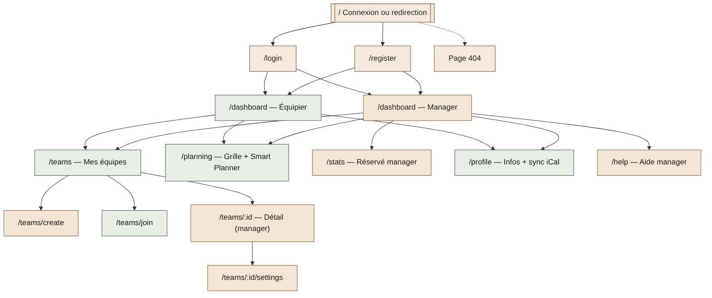
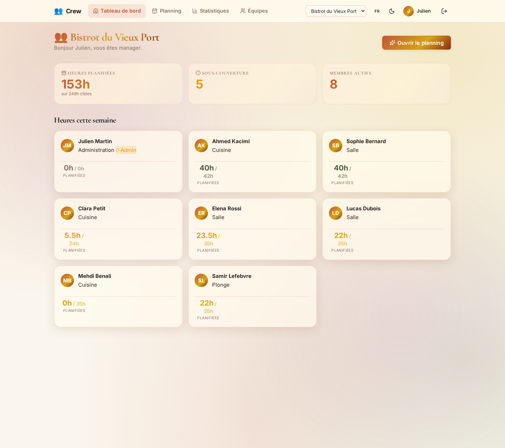
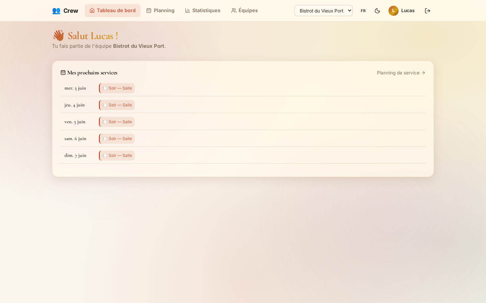
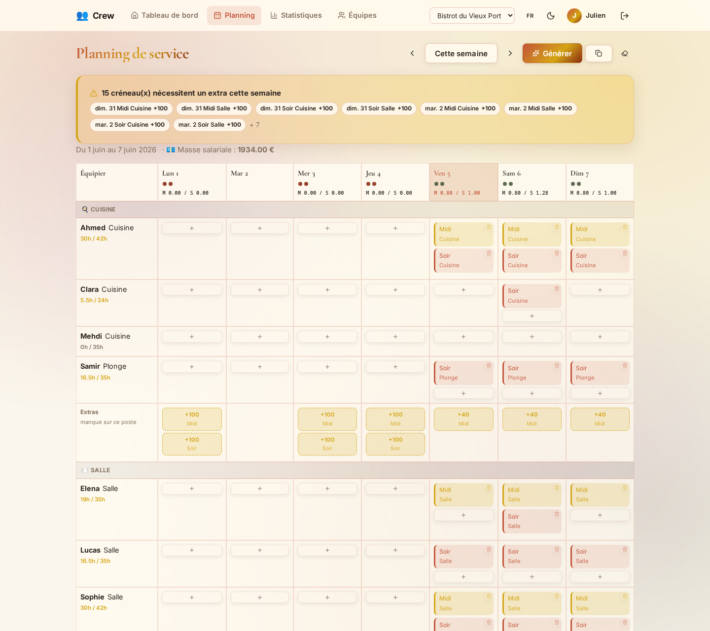
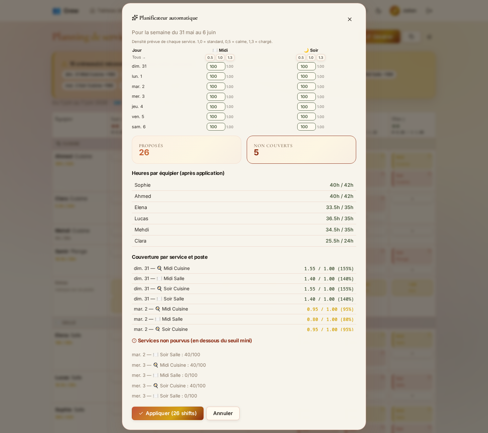
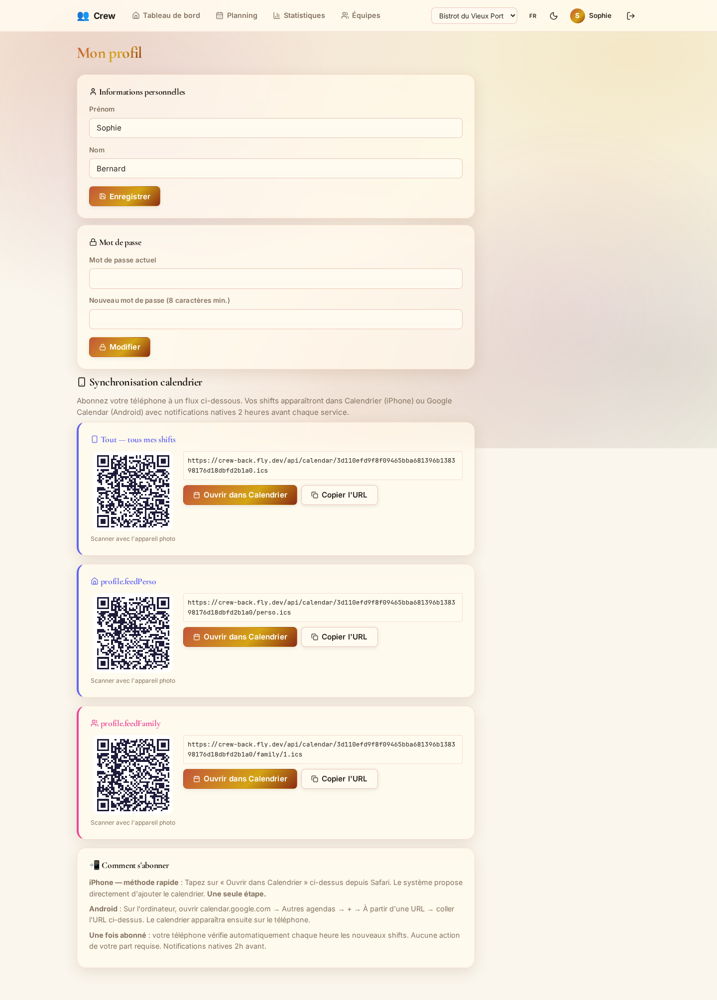
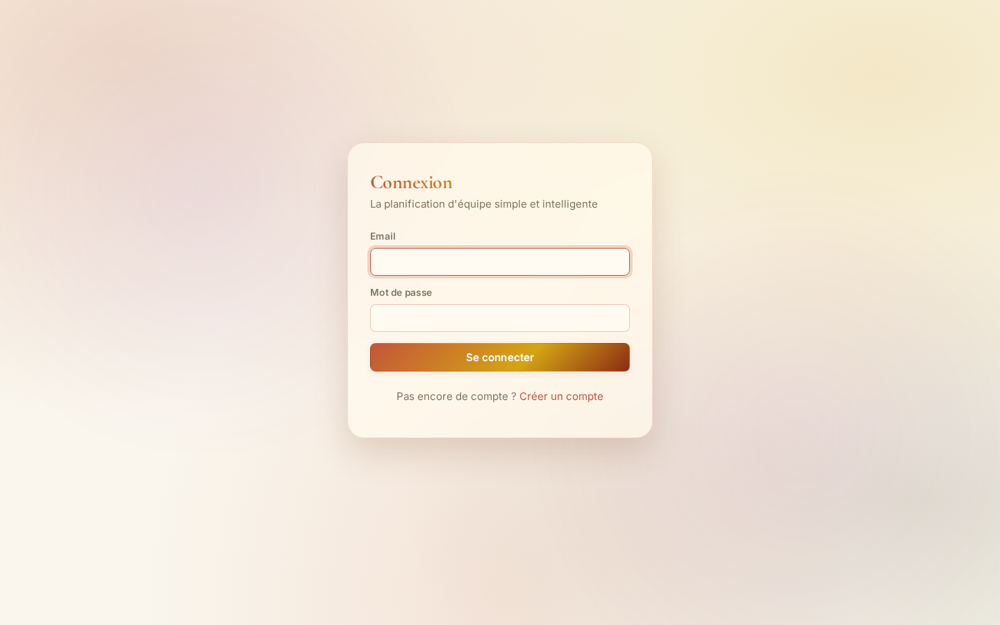
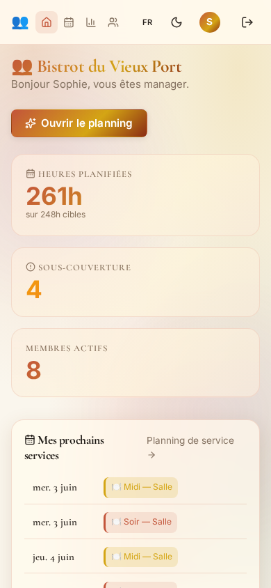
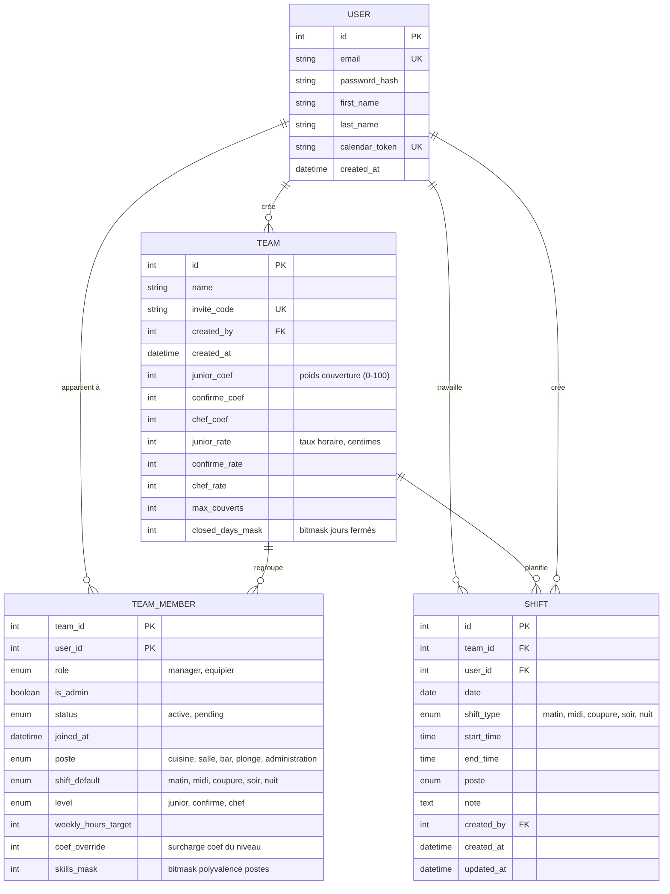

<div class="titlepage">
<div class="logo-mark">
  <div class="bar b1"></div>
  <div class="bar b2"></div>
  <div class="bar b3"></div>
</div>

<h1 class="big-title">Crew</h1>
<p class="big-subtitle">Planning d'équipe intelligent</p>

<p class="tp-subtitle">Application web de planification d'équipe pour la restauration,<br>avec solver d'auto-planning et synchronisation calendrier native</p>

<p class="tp-context">Projet réalisé dans le cadre de la présentation au<br><strong>Titre Professionnel Développeur Web &amp; Web Mobile</strong></p>

<p class="tp-presente">Présenté par</p>
<p class="tp-nom">Vladimir Rodzaevskiy</p>
</div>

<div class="pagebreak"></div>

<div class="toc">

# <span class="letter">S</span>ommaire

<div class="toc-row"><span>Introduction</span><span class="fill"></span><span>p. 3</span></div>

<div class="toc-row"><span>Liste des compétences couvertes par le projet</span><span class="fill"></span><span>p. 4</span></div>
<div class="toc-row sub"><span>I. Développer la partie front-end d'une application web en intégrant les recommandations de sécurité</span><span class="fill"></span><span>p. 4</span></div>
<div class="toc-row sub"><span>II. Développer la partie back-end d'une application web en intégrant les recommandations de sécurité</span><span class="fill"></span><span>p. 5</span></div>

<div class="toc-row"><span>Résumé du projet</span><span class="fill"></span><span>p. 6</span></div>

<div class="toc-row"><span>Cahier des charges</span><span class="fill"></span><span>p. 8</span></div>
<div class="toc-row sub"><span>I. Besoins et objectifs de l'application</span><span class="fill"></span><span>p. 8</span></div>
<div class="toc-row sub"><span>II. User Stories</span><span class="fill"></span><span>p. 10</span></div>
<div class="toc-row sub"><span>III. Arborescence</span><span class="fill"></span><span>p. 12</span></div>
<div class="toc-row sub"><span>IV. MVP</span><span class="fill"></span><span>p. 13</span></div>
<div class="toc-row sub"><span>V. Fonctionnalités détaillées des pages</span><span class="fill"></span><span>p. 15</span></div>
<div class="toc-row sub"><span>VI. Évolutions potentielles</span><span class="fill"></span><span>p. 17</span></div>
<div class="toc-row sub"><span>VII. Wireframe</span><span class="fill"></span><span>p. 18</span></div>
<div class="toc-row sub"><span>VIII. Exemples de maquettes (captures réelles)</span><span class="fill"></span><span>p. 19</span></div>

<div class="toc-row"><span>Spécifications Techniques</span><span class="fill"></span><span>p. 22</span></div>
<div class="toc-row sub"><span>I. Technologies</span><span class="fill"></span><span>p. 22</span></div>
<div class="toc-row sub"><span>II. Création de la base de données</span><span class="fill"></span><span>p. 24</span></div>
<div class="toc-row sub"><span>III. Routes front et back</span><span class="fill"></span><span>p. 30</span></div>

<div class="toc-row"><span>Exemple de raisonnement</span><span class="fill"></span><span>p. 34</span></div>
<div class="toc-row"><span>Conclusion</span><span class="fill"></span><span>p. 36</span></div>

</div>

<div class="pagebreak"></div>

# <span class="letter">I</span>ntroduction

Dans les secteurs à rotation de shifts (restauration, hôtellerie, retail), le planning d'équipe reste très souvent construit à la main : un responsable qui jongle entre un tableau Excel et des messages échangés à droite à gauche, et des équipiers qui découvrent parfois leurs horaires au dernier moment. C'est de ce constat qu'est né **Crew** : automatiser la partie la plus fastidieuse du métier de manager — construire un planning respectueux de la couverture de service, du droit du travail et des préférences de chacun — pour lui laisser le temps de gérer son équipe plutôt que des lignes de tableur.

Ce projet a été réalisé dans le cadre du Titre Professionnel Développeur Web et Web Mobile à **La Plateforme Formation** (Marseille), en tant que projet de fin de formation.

Le projet a été mené seul, du cadrage (user stories, arborescence, wireframes) au développement complet (front React, back Node/Express, base de données MariaDB), en passant par la conception du cœur technique du projet : un solver d'auto-planning capable de proposer une semaine complète en quelques secondes, en tenant compte de la couverture de service, du coût salarial, de la polyvalence des équipiers et des règles de la Convention collective HCR.

Ce dossier présente la démarche complète : les besoins identifiés, les choix techniques faits et pourquoi, et la manière dont chaque décision de modélisation s'appuie sur des sources vérifiables plutôt que sur l'intuition seule.

<div class="pagebreak"></div>

# <span class="letter">L</span>iste des compétences couvertes par le projet

## I. Développer la partie front-end d'une application web en intégrant les recommandations de sécurité

### A. Maquetter une application
En amont du développement, j'ai formalisé les besoins via des user stories (équipier, manager, admin), une arborescence des pages, des wireframes et une charte graphique dédiée (palette « Bistro/Éditorial »). Ces documents ont servi de base à la cohérence visuelle et à la logique de navigation du site (voir *Cahier des charges*, sections II à VIII).

### B. Réaliser une interface utilisateur web statique et adaptable
L'interface est réalisée avec **React 18** et **React Router 6**, en CSS pur (custom properties) pour un design responsive desktop/tablette/mobile. L'UI est découpée en composants réutilisables (`layout`, `dashboard`, `planning`, `teams`, `ui`), et l'accessibilité clavier est prise en compte sur les interactions critiques (déplacement d'un shift via le clavier dans la grille planning).

### C. Développer une interface utilisateur web dynamique
- **React Router** gère la navigation sans rechargement de page.
- **Context API** (`Auth`, `Theme`, `Toast`) centralise les états transverses : session utilisateur, thème clair/sombre, notifications.
- Le **Smart Planner** est entièrement dynamique : sélection de densité de service, calcul asynchrone côté serveur, affichage du résultat (proposés/non couverts) sans rechargement.
- Les formulaires (login, register, paramètres d'équipe) intègrent une validation et des retours d'erreur explicites.
- L'internationalisation (**i18next**, FR/EN) couvre l'intégralité des textes d'interface, sans chaîne codée en dur dans les composants.

<div class="pagebreak"></div>

## II. Développer la partie back-end d'une application web en intégrant les recommandations de sécurité

### A. Créer une base de données
J'ai conçu le MCD/MLD puis j'ai versionné le schéma en **12 migrations SQL** numérotées (`001_users.sql` → `012_labor_costs.sql`), appliquées via un script `npm run migrate`. Un script de seed (`npm run seed`) pré-remplit la base avec des données de démonstration réalistes (« Bistrot du Vieux Port »), ce qui permet de présenter l'application sans ressaisie manuelle.

### B. Développer les composants d'accès aux données
L'accès aux données s'appuie sur des **requêtes SQL préparées via `mysql2`** (pas d'ORM — accès direct et explicite, un choix justifié en section *Exemple de raisonnement*). J'ai structuré des modèles par domaine (`user`, `team`, `teamMember`, `shift`), des controllers dédiés, et un middleware `teamAccess` (`managerRequired`, `adminRequired`) pour la vérification des rôles à chaque route protégée.

### C. Développer la partie back-end d'une application web ou web mobile
- **Authentification** : mots de passe hachés (`bcrypt`, cost 10), session via **JWT** (HS256, expiration 7 jours).
- **Limitation de débit** (`express-rate-limit`) sur les routes sensibles (`/login`, `/register`).
- **Export calendrier natif** : génération de flux iCal (`ical-generator`, RFC 5545) exposés par token opaque, avec QR code (`qrcode`) pour un abonnement en un scan depuis le profil.
- **Sécurité** : protection contre les injections SQL par requêtes préparées systématiques, validation stricte des entrées (`validators/`), CORS configuré, vérification des droits à chaque route (rôle + appartenance à l'équipe).

<div class="pagebreak"></div>

# <span class="letter">R</span>ésumé du projet

**Crew** est une application web de planification d'équipe destinée aux secteurs à rotation de shifts (restauration, hôtellerie, retail, santé). Elle répond à un besoin très concret : donner au manager un outil qui construit un planning respectueux de la couverture de service et du droit du travail en un clic, plutôt qu'un tableur reconstruit chaque semaine à la main.

**Objectifs**
- **Automatiser** la construction du planning hebdomadaire via un solver d'auto-planning (« Smart Planner »).
- **Respecter** la Convention collective HCR (plafonds horaires, repos) comme contrainte dure, pas comme option.
- **Donner de la visibilité** aux équipiers sur leurs horaires, sans dépendre d'un tableau papier ou d'un groupe de discussion.
- **Optimiser** la masse salariale prévisionnelle tout en garantissant la couverture cible.

**Fonctionnalités principales**
- **Authentification** par email + mot de passe, avec distinction de parcours à l'inscription (« Employé » vs « Patron de restaurant »).
- **Gestion d'équipe** : création, code d'invitation, approbation des demandes, configuration par membre (poste, niveau, polyvalence, heures cibles).
- **Planning hebdomadaire** : grille interactive, ajout/déplacement/suppression manuel, clonage ou vidage d'une semaine.
- **Smart Planner** : proposition automatique d'un planning complet, avec aperçu avant validation et signalement des créneaux non couverts.
- **Statistiques** : répartition des shifts par poste et par équipier, évolution sur 30 jours (réservé aux managers).
- **Synchronisation calendrier** : flux iCal personnel ou d'équipe, abonnement natif iPhone/Android sans application supplémentaire.

**Architecture &amp; stack**
- **Front** : React 18 + React Router 6 + Vite, CSS pur (custom properties), i18next (FR/EN), Chart.js.
- **Back** : Node.js 22 + Express 4, requêtes SQL préparées via `mysql2`, JWT + bcrypt.
- **Base de données** : MariaDB 10.11, 4 tables, 12 migrations.
- **Déploiement** : Vercel (front) + Fly.io (back + MariaDB conteneurisée).

**Sécurité &amp; conformité**
- Mots de passe hachés, jamais stockés en clair.
- Rôles et permissions vérifiés à chaque route sensible (middleware dédié).
- Protection contre les injections SQL par requêtes préparées.
- Rate limiting sur l'authentification.

**Limites actuelles &amp; suites prévues**
- Pas d'historique d'achats/paiement (hors périmètre : Crew ne gère pas la facturation, seulement le planning).
- Outils manager à enrichir : statistiques de coût réalisé vs prévisionnel, export PDF du planning.
- Authentification renforcée à prévoir (2FA, login SSO) pour un usage multi-établissements.

<div class="pagebreak"></div>

# <span class="letter">C</span>ahier des charges

## I. Besoins et objectifs de l'application

### A. Besoins

Pour cadrer **Crew**, il faut analyser les besoins d'un manager d'équipe à rotation de shifts (restauration, hôtellerie, retail) et de ses équipiers.

**Constats actuels**
- **La construction du planning** se fait majoritairement à la main (tableur, papier), sans garde-fou automatique sur la couverture ou le droit du travail.
- **Les équipiers** découvrent souvent leur planning tardivement, par des canaux informels (SMS, groupe de discussion), source d'erreurs et de tensions.
- **Le manager** n'a pas de visibilité simple sur le coût salarial prévisionnel de ses choix de planning avant de les valider.

**Solution pour pallier ces constats**
- Un **solver d'auto-planning** qui propose une semaine complète respectant couverture, polyvalence et coût, en quelques secondes.
- Un **flux calendrier natif** pour que chaque équipier reçoive ses shifts directement dans son application calendrier, sans action manuelle du manager.
- Des **paramètres d'équipe éditables** (coefficients, taux horaires, jours d'ouverture) pour que le solver reflète la réalité de chaque établissement.

### B. Objectifs

**Objectif général**
Fournir une application de planification d'équipe fiable qui automatise la construction du planning tout en respectant la couverture de service et le droit du travail.

**Objectifs spécifiques**
- **Offrir** un solver capable de proposer un planning complet en respectant les contraintes métier (couverture, HCR, coût).
- **Proposer** un espace équipier avec consultation du planning et synchronisation calendrier native.
- **Permettre** au manager de configurer finement son équipe (postes, niveaux, polyvalence, taux horaires).
- **Garantir** les bonnes pratiques de sécurité (mots de passe hachés, rôles vérifiés, requêtes préparées).

**Indicateurs de succès**
- Un planning hebdomadaire complet est généré par le Smart Planner en moins de 2 secondes.
- Le manager n'a besoin d'aucune ressaisie manuelle pour la majorité des créneaux d'une semaine standard.
- Zéro créneau planifié en dehors des plafonds horaires de la Convention HCR.

<div class="pagebreak"></div>

## II. User Stories

**Légende** : <span class="legend-mvp">MVP</span> · <span class="legend-futur">Futurs MVP</span>

<table class="stories mvp-table">
<tr><th>En tant que</th><th>Je souhaite</th><th>Afin de</th></tr>
<tr><td>visiteur</td><td>m'inscrire en précisant si je suis employé ou patron</td><td>démarrer avec le bon parcours (rejoindre / créer une équipe)</td></tr>
<tr><td>utilisateur</td><td>me connecter / me déconnecter</td><td>accéder à mon espace en toute sécurité</td></tr>
<tr><td>patron</td><td>créer une équipe et obtenir un code d'invitation</td><td>constituer mon équipe sur Crew</td></tr>
<tr><td>employé</td><td>rejoindre une équipe avec un code</td><td>accéder au planning de mon établissement</td></tr>
<tr><td>manager</td><td>approuver les demandes en attente et fixer le rôle</td><td>contrôler qui accède au planning</td></tr>
<tr><td>manager</td><td>configurer poste, niveau, polyvalence et heures cibles de chaque équipier</td><td>que le Smart Planner produise des propositions réalistes</td></tr>
<tr><td>manager</td><td>générer un planning automatiquement (Smart Planner)</td><td>gagner le temps passé à planifier à la main</td></tr>
<tr><td>manager</td><td>modifier un shift manuellement</td><td>corriger un cas particulier</td></tr>
<tr><td>manager</td><td>dupliquer ou vider une semaine</td><td>gagner du temps sur les semaines récurrentes</td></tr>
<tr><td>équipier</td><td>consulter mes prochains shifts</td><td>connaître mes horaires sans appeler mon manager</td></tr>
<tr><td>utilisateur</td><td>m'abonner à mon flux iCal personnel (QR code ou URL)</td><td>recevoir mes shifts nativement sur mon téléphone</td></tr>
<tr><td>manager</td><td>exporter le planning d'équipe en iCal</td><td>le partager en lecture seule (ex. affichage cuisine)</td></tr>
<tr><td>manager</td><td>consulter les statistiques de l'équipe</td><td>repérer les déséquilibres de charge</td></tr>
<tr><td>utilisateur</td><td>modifier mon profil et mon mot de passe</td><td>garder mes informations à jour</td></tr>
<tr><td>manager</td><td>réinitialiser le mot de passe d'un équipier</td><td>débloquer une situation sans support technique</td></tr>
<tr><td>équipier non francophone</td><td>basculer l'interface en anglais</td><td>comprendre mon planning sans barrière de langue</td></tr>
</table>

<table class="stories futur-table">
<tr><th>En tant que</th><th>Je souhaite</th><th>Afin de</th></tr>
<tr><td>manager</td><td>voir le coût salarial réalisé vs prévisionnel</td><td>piloter ma rentabilité au fil du mois</td></tr>
<tr><td>équipier</td><td>poser une demande d'absence ou d'échange de shift</td><td>gérer mes disponibilités sans passer par un message informel</td></tr>
<tr><td>manager</td><td>exporter le planning en PDF</td><td>l'afficher en cuisine sans accès écran</td></tr>
</table>

<div class="pagebreak"></div>

## III. Arborescence



*(Orange = accès manager · Vert = accès commun équipier/manager · Beige = accès public)*

<div class="pagebreak"></div>

## IV. MVP

Le **Produit Minimum Viable** vise à offrir une expérience de planification fiable : authentification sécurisée, gestion d'équipe avec approbation, planning hebdomadaire éditable, Smart Planner respectant la couverture et le droit du travail, et synchronisation calendrier native.

**Fonctionnalités incluses dans le MVP**
- L'utilisateur (équipier, manager ou admin) peut s'authentifier par email + mot de passe et se déconnecter.
- Un espace équipe permet de créer/rejoindre une équipe et de gérer les membres.
- Le planning est consultable et éditable selon le rôle.

### A. Équipier

**Arrive sur le dashboard et peut :**
- **Consulter** ses prochains shifts (jour, créneau, poste).
- **Accéder** à son profil : informations personnelles, mot de passe, synchronisation calendrier (QR code + URL iCal).
- **Rejoindre** une équipe via un code d'invitation.
- **Changer** la langue de l'interface (FR/EN) et le thème (clair/sombre).

### B. Manager

**Accède en plus à :**
- **Le planning complet** de l'équipe : grille 7 jours, ajout/édition/suppression de shifts.
- **Le Smart Planner** : génération automatique, choix de densité de service, aperçu avant validation.
- **La gestion d'équipe** : approbation des demandes, configuration des membres (poste, niveau, polyvalence, heures cibles).
- **Les statistiques** : répartition des shifts par poste et par équipier.
- **Les paramètres d'équipe** : coefficients de couverture, taux horaires, jours d'ouverture.

### C. Administrateur (manager avec `is_admin`)

- **Régénérer** le code d'invitation de l'équipe.
- **Retirer** un membre de l'équipe.
- **Réinitialiser** le mot de passe d'un équipier.

### D. Sécurité (MVP)

- **Mots de passe** hachés (`bcrypt`, cost 10).
- **Validation** stricte des formulaires côté front et back, messages d'erreur explicites.
- **Middlewares** de rôle sur les routes protégées (`managerRequired`, `adminRequired`).
- **Protection** des injections SQL via requêtes préparées systématiques (`mysql2`).
- **Rate limiting** sur les routes d'authentification.

<div class="pagebreak"></div>

## V. Fonctionnalités détaillées des pages

**1) Page Connexion / Inscription**
- Champs : email, mot de passe (inscription : + prénom, nom, type de compte).
- Redirection après succès : dashboard équipier ou manager selon le rôle.
- Messages d'erreur explicites, rate limiting anti brute-force.

**2) Dashboard Équipier**
- Message de bienvenue personnalisé, nom de l'équipe active.
- Liste des prochains shifts (jour, créneau, poste).
- État « en attente d'approbation » si le membre n'est pas encore actif.

**3) Dashboard Manager**
- Indicateurs : heures planifiées vs cible, membres actifs, créneaux en sous-couverture.
- Accès rapide au planning et aux demandes en attente.

**4) Page Planning**
- Grille 7 jours × équipiers, navigation semaine précédente/suivante.
- Ajout, édition, suppression de shift manuel.
- Bouton Smart Planner (génération automatique).

**5) Smart Planner (modale)**
- Choix de la densité de service (calme / normal / chargé).
- Option « repartir d'un planning vierge ».
- Aperçu : shifts proposés, créneaux non couverts, heures par équipier.
- Application en un clic, doublons ignorés silencieusement.

**6) Page Équipes / Créer / Rejoindre**
- Liste des équipes de l'utilisateur.
- Création (nom) ou adhésion (code d'invitation à 10 caractères).

**7) Détail équipe (manager)**
- Liste des membres en attente (approuver / refuser) et actifs.
- Configuration par membre : poste, niveau, polyvalence, heures cibles.
- Régénération du code d'invitation.

**8) Paramètres équipe**
- Coefficients de couverture par niveau, taux horaires, capacité de service.
- Jours d'ouverture (bitmask 7 jours).

**9) Statistiques (réservé manager)**
- Shifts par poste (90 jours), par équipier (30 jours), évolution du volume.

**10) Profil**
- Informations personnelles, changement de mot de passe.
- Synchronisation calendrier : QR code, URL iCal (perso ou par équipe), instructions iPhone/Android.

**11) Page 404**
- Message clair, lien de retour vers le dashboard.

<div class="pagebreak"></div>

## VI. Évolutions potentielles

**Côté équipier**
- Demande d'absence et d'échange de shift directement dans l'app.
- Notifications push (shift ajouté/modifié, demande approuvée).

**Côté manager**
- Coût salarial réalisé vs prévisionnel (comparaison mensuelle).
- Export PDF du planning pour affichage sans écran.

**Côté technique / qualité**
- Authentification renforcée (2FA, SSO) pour un usage multi-établissements.
- Sauvegarde automatisée de la base de données.
- Historisation des versions d'un planning (audit trail).

<div class="pagebreak"></div>

## VII. Wireframe

Exemple de wireframe basé sur la page Planning (grille + Smart Planner) :

```
┌──────────────────────────────────────────────────────┐
│ Planning de service      Semaine préc. | Cette semaine │
│                                  | Semaine suivante      │
│                        Du 14/07 au 20/07    [⚡ Générer] │
├──────────┬──────┬──────┬──────┬──────┬──────┬──────┬───┤
│ Équipier │ Lun  │ Mar  │ Mer  │ Jeu  │ Ven  │ Sam  │Dim│
├──────────┼──────┼──────┼──────┼──────┼──────┼──────┼───┤
│ Ahmed     │      │Midi  │      │Soir  │Midi  │Soir  │   │
│ (Chef)    │      │Cuis. │      │Cuis. │Cuis. │Cuis. │   │
│ Elena     │      │Midi  │Soir  │      │Midi  │Soir  │   │
│ (Confirmé)│      │Salle │Salle │      │Salle │Salle │   │
├──────────┴──────┴──────┴──────┴──────┴──────┴──────┴───┤
│           [ + Ajouter un shift ]                         │
└──────────────────────────────────────────────────────┘
```

Voir la capture d'écran réelle de cet écran en section suivante (VIII, `07-planning-grid.png`).

<div class="pagebreak"></div>

## VIII. Exemples de maquettes (captures réelles)

**Dashboard :**

<div class="shot-row">


</div>

**Planning &amp; Smart Planner :**

<div class="shot-row">


</div>

**Profil &amp; synchronisation calendrier :**

<div class="shot-row">


</div>

**Version mobile :**

<div class="shot-row mobile">


</div>

<div class="pagebreak"></div>

# <span class="letter">S</span>pécifications Techniques

Pour construire **Crew**, j'ai choisi une stack orientée exécution temps réel et accès direct aux données (pas d'ORM), avec un back qui expose la logique métier — en particulier le solver — via une API REST consommée par un front React.

## I. Technologies

**Developer experience &amp; gestionnaire de paquets**
- **Git / GitHub** (branche `main`)
- **Node.js 22** + npm
- **nodemon** (rechargement à chaud back en dev)
- **Playwright** (tests end-to-end)
- **phpMyAdmin** (inspection ponctuelle de la base)

**Front-end**
- **React 18** + **React Router 6** (navigation SPA)
- **Vite** (dev server + build)
- **i18next** + `react-i18next` + `i18next-browser-languagedetector` (FR/EN)
- **Chart.js** + `react-chartjs-2` (statistiques)
- **lucide-react** (icônes)
- **qrcode** (QR code d'abonnement calendrier)
- **Context API** (session, thème, notifications)
- **CSS pur** (custom properties, palette « Bistro/Éditorial »)

**Back-end**
- **Express 4** (routes, middlewares, controllers)
- **mysql2** (requêtes SQL préparées, pool de connexions)
- **bcrypt** (hachage des mots de passe, cost 10)
- **jsonwebtoken** (session JWT HS256, 7 jours)
- **express-rate-limit** (anti brute-force sur l'authentification)
- **ical-generator** (export calendrier RFC 5545)
- **cors**, **dotenv**

**Base de données &amp; déploiement**
- **MariaDB 10.11**
- **Vercel** (front, build Vite)
- **Fly.io** (back + MariaDB conteneurisée)

<div class="pagebreak"></div>

## II. Création de la base de données

### A. MCD



### B. MLD

```
users            (id, email, password_hash, first_name, last_name, calendar_token, created_at)

teams            (id, name, invite_code, created_at,
                   junior_coef, confirme_coef, chef_coef,
                   junior_rate, confirme_rate, chef_rate,
                   max_couverts, closed_days_mask, #created_by)

team_members     (#team_id, #user_id, role, is_admin, status, joined_at,
                   poste, shift_default, level, weekly_hours_target,
                   coef_override, skills_mask)

shifts           (id, date, shift_type, start_time, end_time, poste, note,
                   created_at, updated_at, #team_id, #user_id, #created_by)
```

<div class="pagebreak"></div>

### C. Dictionnaire des données

**users**

| Nom de la donnée | Désignation | Type | Contrainte |
|---|---|---|---|
| id | Identifiant unique de l'utilisateur | INT | PK, AI |
| email | Adresse e-mail | VARCHAR(255) | NOT NULL, UNIQUE, INDEX |
| password_hash | Mot de passe (hash bcrypt) | VARCHAR(255) | NOT NULL |
| first_name | Prénom | VARCHAR(100) | NOT NULL |
| last_name | Nom | VARCHAR(100) | NOT NULL |
| calendar_token | Jeton d'URL du flux iCal personnel | VARCHAR(64) | NOT NULL, UNIQUE, INDEX |
| created_at | Date de création | DATETIME | DEFAULT CURRENT_TIMESTAMP |

**teams**

| Nom de la donnée | Désignation | Type | Contrainte |
|---|---|---|---|
| id | Identifiant de l'équipe | INT | PK, AI |
| name | Nom de l'équipe | VARCHAR(100) | NOT NULL |
| invite_code | Code d'invitation (`CREW-XXXX-XXXX`) | VARCHAR(32) | NOT NULL, UNIQUE, INDEX |
| created_by | Créateur de l'équipe | INT | FK → users.id, ON DELETE RESTRICT |
| junior_coef / confirme_coef / chef_coef | Poids de couverture par niveau | INT | DEFAULT 15 / 40 / 60 |
| junior_rate / confirme_rate / chef_rate | Taux horaire par niveau (centimes) | INT | DEFAULT 1200 / 1400 / 1900 |
| max_couverts | Capacité de service à 100 % | INT | DEFAULT 100 |
| closed_days_mask | Bitmask des jours fermés | INT | DEFAULT 2 (lundi) |
| created_at | Date de création | DATETIME | DEFAULT CURRENT_TIMESTAMP |

**team_members**

| Nom de la donnée | Désignation | Type | Contrainte |
|---|---|---|---|
| team_id | Équipe concernée | INT | PK, FK → teams.id, ON DELETE CASCADE |
| user_id | Utilisateur concerné | INT | PK, FK → users.id, ON DELETE CASCADE |
| role | Rôle dans l'équipe | ENUM('manager','equipier') | DEFAULT 'equipier' |
| is_admin | Droits d'administration | BOOLEAN | DEFAULT FALSE |
| status | Statut d'adhésion | ENUM('active','pending') | DEFAULT 'pending' |
| poste | Poste primaire | ENUM(5 valeurs) | NULL autorisé |
| shift_default | Créneau habituel | ENUM(5 valeurs) | NULL autorisé |
| level | Niveau d'expérience | ENUM('junior','confirme','chef') | DEFAULT 'confirme' |
| weekly_hours_target | Heures cibles hebdomadaires | INT | NULL = exclu du solver |
| coef_override | Coefficient personnalisé | INT | NULL = hérite du niveau |
| skills_mask | Polyvalence (bitmask 5 bits) | INT | NULL autorisé |
| joined_at | Date d'adhésion | DATETIME | DEFAULT CURRENT_TIMESTAMP |

**shifts**

| Nom de la donnée | Désignation | Type | Contrainte |
|---|---|---|---|
| id | Identifiant du créneau | INT | PK, AI |
| team_id | Équipe concernée | INT | FK → teams.id, ON DELETE CASCADE |
| user_id | Équipier planifié | INT | FK → users.id, ON DELETE CASCADE |
| date | Jour calendaire | DATE | NOT NULL |
| shift_type | Créneau (matin/midi/coupure/soir/nuit) | ENUM(5 valeurs) | NOT NULL |
| start_time / end_time | Horaires précis (optionnels) | TIME | NULL autorisé |
| poste | Poste tenu sur ce créneau | ENUM(5 valeurs) | NOT NULL |
| note | Commentaire libre | TEXT | NULL autorisé |
| created_by | Auteur du créneau | INT | FK → users.id, ON DELETE SET NULL |
| created_at / updated_at | Horodatage | DATETIME | DEFAULT / ON UPDATE CURRENT_TIMESTAMP |

**Règle d'unicité** : `(user_id, date, shift_type)` — un équipier ne peut pas être planifié deux fois sur le même créneau du même jour.

<div class="pagebreak"></div>

## III. Routes front et back

### A. Back-end (API)

**Légende** — *Public* : accessible sans compte · *Auth* : utilisateur connecté · *Rôle* : accès limité au(x) rôle(s) indiqué(s)

**Authentification**

| Méthode | Endpoint | Sortie | Accès |
|---|---|---|---|
| POST | /auth/register | Créer un compte | Public (rate limited) |
| POST | /auth/login | Se connecter | Public (rate limited) |
| GET | /auth/me | Profil courant | Auth |
| POST | /auth/change-password | Changer le mot de passe | Auth |

**Équipes**

| Méthode | Endpoint | Sortie | Accès |
|---|---|---|---|
| GET | /teams | Mes équipes | Auth |
| POST | /teams | Créer une équipe | Auth |
| POST | /teams/join | Demander à rejoindre | Auth |
| GET | /teams/:teamId | Détail équipe + membres | Auth (membre) |
| PATCH | /teams/:teamId | Renommer | Rôle : manager |
| DELETE | /teams/:teamId | Supprimer | Rôle : admin |
| POST | /teams/:teamId/leave | Quitter l'équipe | Auth (membre) |
| POST | /teams/:teamId/regenerate-code | Régénérer le code | Rôle : admin |
| POST | /teams/:teamId/approve/:userId | Approuver un membre | Rôle : manager |
| PATCH | /teams/:teamId/members/:userId | Modifier un membre | Rôle : manager |
| DELETE | /teams/:teamId/members/:userId | Retirer un membre | Rôle : admin |
| POST | /teams/:teamId/members/:userId/reset-password | Réinitialiser mot de passe | Rôle : admin |
| GET/PUT | /teams/:teamId/settings | Lire / modifier les paramètres | Rôle : manager |

**Planning &amp; Smart Planner**

| Méthode | Endpoint | Sortie | Accès |
|---|---|---|---|
| GET | /shifts | Liste des shifts | Auth |
| GET | /shifts/upcoming | Mes prochains shifts | Auth |
| GET | /shifts/summary | Résumé heures | Auth |
| POST | /shifts | Créer un shift | Rôle : manager |
| PUT/DELETE | /shifts/:id | Modifier / supprimer | Rôle : manager |
| POST | /shifts/generate-plan | Aperçu Smart Planner | Rôle : manager |
| POST | /shifts/apply-plan | Appliquer le planning proposé | Rôle : manager |
| POST | /shifts/clone-week | Dupliquer la semaine | Rôle : manager |
| DELETE | /shifts/clear-week | Vider la semaine | Rôle : manager |

**Calendrier &amp; statistiques**

| Méthode | Endpoint | Sortie | Accès |
|---|---|---|---|
| GET | /calendar/:token/perso.ics | Flux iCal personnel | Public (token opaque) |
| GET | /calendar/:token/team/:teamId.ics | Flux iCal d'équipe | Public (token opaque) |
| GET | /stats/dashboard | Indicateurs clés | Rôle : manager |
| GET | /stats/charts | Données graphiques | Rôle : manager |
| PATCH | /users/me | Modifier mon profil | Auth |

<div class="pagebreak"></div>

### B. Front-end (routes React Router)

| Route | Page | Accès |
|---|---|---|
| /login | Connexion | Public |
| /register | Inscription | Public |
| /dashboard | Tableau de bord (vue selon rôle) | Auth |
| /teams | Mes équipes | Auth |
| /teams/create | Créer une équipe | Auth |
| /teams/join | Rejoindre une équipe | Auth |
| /teams/:id | Détail équipe | Rôle : manager |
| /teams/:id/settings | Paramètres équipe | Rôle : manager |
| /planning | Planning + Smart Planner | Auth |
| /stats | Statistiques | Rôle : manager |
| /profile | Profil + synchronisation calendrier | Auth |
| /help | Aide manager | Rôle : manager |
| * | Page 404 | Public |

<div class="pagebreak"></div>

# <span class="letter">E</span>xemple de raisonnement

**Veille &amp; recherche technique**

Pour compenser les zones de doute (choix d'architecture, arbitrages techniques), j'applique une méthode systématique avant toute décision structurante.

**Démarche**
- **Formuler** la question : quel outil/approche pour mon besoin précis ?
- **Comparer** 2-3 sources fiables (documentation officielle, publications académiques) et croiser les informations.
- **Évaluer** selon des critères explicites : performance, lisibilité du code, temps réel, maintenabilité.
- **Tester** rapidement en local sur un cas représentatif.
- **Décider**, avec une alternative de secours documentée.

**Exemple — solveur heuristique vs programmation linéaire (MIP) pour le Smart Planner**

**Contexte** : le cœur technique de Crew est la génération automatique du planning. Il fallait choisir entre un solveur de programmation linéaire en nombres entiers (MIP, ex. Google OR-Tools) et une heuristique maison (greedy multi-pass avec scoring).

**Constats (recherche comparative)** :
- Bard, Binici &amp; deSilva (2003, *Computers &amp; Operations Research*) formulent l'affectation de personnel comme un MIP : couverture en contrainte, masse salariale en objectif à minimiser — l'approche académique de référence.
- Ernst, Jiang, Krishnamoorthy &amp; Sier (2004, *European Journal of Operational Research*) confirment, dans leur revue de littérature, que le coût horaire est l'objectif dominant dans la quasi-totalité des modèles appliqués de planification de personnel.
- Un MIP garantit l'optimalité globale mais son temps de résolution peut devenir prohibitif à l'échelle d'une petite équipe avec relance interactive (le manager doit pouvoir régénérer plusieurs fois en ajustant la densité), et son résultat est plus difficile à expliquer à un utilisateur non technique qu'une suite de règles.
- Une heuristique gloutonne à plusieurs passes (couverture idéale → tolérance horaire → polyvalence → coût → équilibrage final) suit la même philosophie objectif/contrainte que le MIP, mais reste explicable pas à pas et s'exécute en temps réel.

**Décision** : Crew adopte l'heuristique multi-pass plutôt qu'un MIP global, pour conserver une exécution instantanée compatible avec un usage interactif (le manager régénère et ajuste plusieurs fois) et un comportement traçable (chaque shift proposé peut être justifié par la passe qui l'a produit). Le compromis assumé est une optimalité locale plutôt que globale — acceptable dans ce contexte où la vitesse de service et l'explicabilité priment sur le dernier pourcent d'optimisation théorique.

*(Sources détaillées et bibliographie complète : `annexes/JUSTIFICATION_SCIENTIFIQUE.md`.)*

<div class="pagebreak"></div>

# <span class="letter">C</span>onclusion

En conclusion, ce projet m'a permis de transformer un problème vécu sur le terrain — la construction manuelle du planning d'équipe — en une application fonctionnelle qui automatise cette tâche tout en respectant la couverture de service et le droit du travail.

Même si j'ai mené Crew de façon autonome, j'ai adopté une organisation proche d'un cadre professionnel : cadrage documenté avant développement, versionnage systématique du schéma de base de données, et une démarche de veille technique tracée pour chaque décision structurante.

Le projet m'a confronté à des défis techniques concrets :
- **Modélisation** d'un solver d'auto-planning respectant plusieurs contraintes simultanées (couverture, droit du travail, coût, polyvalence).
- **Structuration** du schéma de données pour supporter cette logique sans complexifier l'accès aux données.
- **Sécurisation** de bout en bout : authentification, rôles, requêtes préparées.

À chaque étape, j'ai combiné recherche académique, tests et documentation pour progresser rapidement et justifier mes choix plutôt que de les improviser. Je retiens surtout une montée en compétence significative sur l'écosystème Node/React et sur la modélisation de problèmes métier complexes en règles explicables.

La version actuelle est stable et déployée en production. Les suites naturelles porteront sur le suivi du coût salarial réalisé, la gestion des demandes d'absence, et une authentification renforcée pour un usage multi-établissements.

Grâce à ce projet, mon envie de progresser dans le développement web s'est confirmée, avec une approche à la fois technique et réfléchie que je compte poursuivre dans un contexte professionnel.
